# Multi-agent roadmap

Этот документ задаёт порядок поставки, зависимости и контрольные точки. Он не
заменяет требования из [MULTI_AGENT_SPEC.md](MULTI_AGENT_SPEC.md) и не является
источником статуса отдельных задач: атомарный статус хранится в
[TODO.md](TODO.md).

## Обозначения и ownership

- `CCM` — репозиторий `codex-claude-mode`: TUI, Rust projections и operator UX.
- `AOR` — репозиторий `agent-orchestrator`: authoritative Task/Run state,
  journal, policy, dependencies и adapters.
- `SHARED` — согласованный wire contract и fixtures, реализуемые в обоих repo.
- `P0`…`P8` — фазы; `G0`…`G8` — обязательные exit gates.
- Linux и macOS являются gate каждого vertical slice, а не отдельной поздней
  задачей. Unsupported capability должна быть видима и не может молча ослаблять
  policy.

## Dependency graph

```mermaid
flowchart LR
  P0["P0 Baseline"] --> G0{"G0"}
  G0 --> P1["P1 Shared contract"] --> G1{"G1"}
  G1 --> P2["P2 Read-only bridge"] --> G2{"G2"}
  G2 --> P3["P3 Codex shadow"] --> G3{"G3"}
  G3 --> P4["P4 Live Codex slices"] --> G4{"G4"}
  G4 --> P5["P5 Claude adapter"] --> G5{"G5"}
  G5 --> P6["P6 Compare and bus"] --> G6{"G6"}
  G6 --> P7["P7 Operator integrations"] --> G7{"G7"}
  G6 --> P8["P8 Remote access"] --> G8{"G8"}
  G7 --> P8
```



Текстовый critical path:

```text
P0/G0 → P1/G1 → P2/G2 → P3/G3 → P4/G4 → P5/G5 → P6/G6
                                                   ├→ P7/G7 ─┐
                                                   └─────────┴→ P8/G8
```

## Parallel lanes

| Lane | Owner | Может идти параллельно | Ограничение |
|---|---|---|---|
| Protocol and fixtures | SHARED | platform test harness | Wire changes блокируют downstream phases. |
| Orchestration runtime | AOR | CCM read-only projections | Public contract меняется только отдельным решением владельца AOR. |
| Operator client | CCM | AOR implementation после fixtures | CCM не создаёт второй broker или authoritative DB. |
| Platform parity | SHARED | каждый vertical slice | Gate не проходит без Linux/macOS evidence. |
| Security and observability | SHARED | после появления соответствующей capability | Совет LLM не может переопределять deterministic policy. |
| Optional integrations | CCM/AOR | после G6 | IDE, RAG, chat и SaaS не блокируют core MVP. |

## Phases and gates

### P0 — Baseline freeze

Owner: `CCM`. Entry: текущее dirty-состояние сохранено и не объявлено релизом.

- Инвентаризировать shipped, tested, unverified и planned behavior.
- Синхронизировать README с фактическим UX.
- Проверить, разбить и атомарно зафиксировать накопившийся milestone.

`G0`: чистая воспроизводимая baseline-сборка; тесты и release evidence сохранены;
известные macOS gaps перечислены. Stop gate: нельзя маркировать `0.4.7` готовой
только по версии в `Cargo.toml` или наличию файлов в dirty worktree.

Release slice: `R0 — stable direct-Codex baseline`.

### P1 — Shared protocol contract

Owner: `SHARED`. Entry: `G0`.

- Versioned bounded JSONL envelopes, sequence/cursor, correlation/causation,
  idempotency и expected revision.
- Общие golden fixtures для lifecycle, reconnect, gaps, duplicates, conflicts,
  approvals и неизвестных версий/типов.

`G1`: Python и Rust читают одни fixtures и одинаково fail closed. Stop gate:
никаких live commands или provider migration до совместимости fixtures.

Release slice: `R1 — protocol fixture kit`.

### P2 — Read-only orchestrator bridge

Owner: `AOR + CCM`. Entry: `G1`.

- AOR предоставляет read-only `serve --stdio` snapshot/replay.
- CCM получает neutral projections и reconnect, сохраняя ephemeral UI state.

`G2`: bridge не мутирует authoritative state; replay не теряет и не дублирует
события; bounded backpressure проверен на Linux/macOS. Stop gate: при gap или
несовместимости клиент отключает projection, а не угадывает состояние.

Release slice: `R2 — read-only multi-agent observer`.

### P3 — Codex shadow observation

Owner: `CCM + AOR`. Entry: `G2`.

- Нормализовать direct Codex observations в shadow path.
- Сравнить Rust/Python projections, crash/reconnect/deduplication.

`G3`: одинаковые terminal outcomes и projection state на golden и integration
scenarios. Stop gate: все действия остаются direct-Codex при расхождении.

Release slice: `R3 — Codex shadow parity`.

### P4 — Live Codex capabilities

Owner: `AOR + CCM`. Entry: `G3` и отдельное разрешение на public AOR contract.

- Переносить по одной capability: `Observe`, затем process ownership,
  `Launch`, `Cancel`, `Approval`.
- Сохранять документированный `--backend direct-codex` fallback.

`G4`: crash/lease/reconciliation дают ровно один terminal outcome; permission
ceiling и approval digest доказуемы. Stop gate: следующая capability не
включается до fixtures и rollback предыдущей.

Release slice: `R4 — orchestrated Codex pilot`.

### P5 — Claude as second provider

Owner: `AOR + CCM`. Entry: `G4`.

- Claude adapter, session binding, capability negotiation и evidence effective
  permissions; UI не уравнивает названия sandbox разных vendors.

`G5`: Codex и Claude одновременно выполняют задачи на Linux/macOS с честными
`supported/degraded/unsupported` состояниями. Stop gate: Gemini/Grok не
добавляются, пока второй adapter не подтвердил контракт.

Release slice: `R5 — two-provider workspace`.

### P6 — Compare and durable bus

Owner: `AOR + SHARED + CCM`. Entry: `G5`.

- Immutable `TaskSnapshot`, bounded fan-out, compare latency/usage/artifacts.
- Durable inbox/outbox, dependencies, wake-up, scoped MCP bus tools и skills.

`G6`: одинаковый digest задачи, idempotent delivery, немедленная разблокировка,
bounded context/depth/fan-out/budget и сохранение partial results. Это core MVP
gate. Stop gate: никакого silent winner или auto-routing.

Release slice: `R6 — multi-provider MVP`.

### P7 — Optional operator integrations

Owner: `CCM/AOR` по adapter boundary. Entry: `G6`.

Независимые tracks: VS Code/Cursor extension, OTLP, code intelligence/RAG,
Telegram/Slack и MCP-first SaaS registry. Каждый track имеет собственный
security/capability gate и может выпускаться отдельно.

`G7`: включённые integrations не становятся source of truth, не получают raw
credentials и не ослабляют policy; отключение не ломает core. Stop gate:
optional track не задерживает core release и не добавляется без acceptance.

Release slices: `R7a IDE`, `R7b observability`, `R7c retrieval`, `R7d chat`,
`R7e SaaS MCP`.

### P8 — Remote access

Owner: `SHARED`. Entry: `G6`, а для богатого remote UX также релевантный `G7`.

- Принять Remote ADR; первым прототипом использовать SSH stdio с теми же
  envelopes/cursor.
- HTTPS/WSS, AG-UI, federation и network streams рассматривать только после
  threat model и измерений.

`G8`: identity, RBAC, approval attribution, revocation, retention, path mapping,
replay protection и backpressure проверены; Linux/macOS работают как client и
host. Stop gate: нельзя публиковать listener до security review.

Release slice: `R8 — secure remote preview`.

## Scope rule

Core MVP заканчивается на `G6`. Всё из P7/P8 является отдельным opt-in slice.
Новая идея сначала попадает в specification/deferred registry и становится
roadmap work только после определения owner, dependencies, acceptance и gate.
